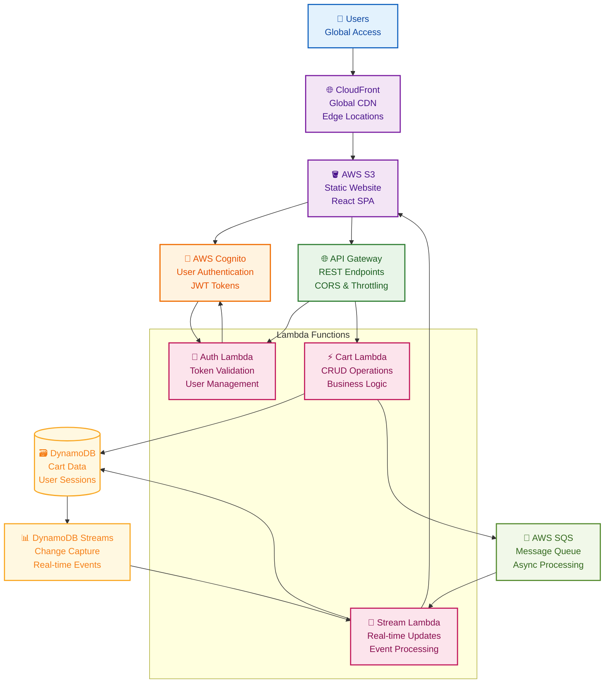

# Serverless Shopping Cart Application

A fully serverless e-commerce shopping cart built on AWS cloud services with secure authentication, real-time updates, and scalable event-driven architecture. Features global content delivery, managed user authentication, and serverless backend processing.

## What It Does

**Shopping Experience Journey:**
1. **User Authentication** → Secure login/signup using AWS Cognito with JWT tokens
2. **Product Browsing** → Fast global content delivery via CloudFront CDN
3. **Cart Management** → Real-time add/remove/update operations with instant feedback
4. **Event Processing** → Asynchronous cart operations using Lambda and SQS
5. **Data Synchronization** → Real-time updates across devices using DynamoDB Streams

## System Architecture



## Tech Stack

**Frontend:** React.js, AWS S3 Static Hosting, CloudFront CDN  
**Authentication:** AWS Cognito, JWT Tokens, Federated Identity  
**Backend:** AWS Lambda (Node.js), API Gateway, Serverless Framework  
**Database:** DynamoDB, DynamoDB Streams for real-time data  
**Messaging:** AWS SQS for asynchronous processing  
**Infrastructure:** Fully serverless, auto-scaling, pay-per-use

## Key Features

- 🌐 **Global Performance** - CloudFront CDN for fast worldwide content delivery
- 🔐 **Secure Authentication** - AWS Cognito with JWT tokens and federated login
- ⚡ **Serverless Backend** - Lambda functions for cart operations with automatic scaling
- 📨 **Asynchronous Processing** - SQS message queues for reliable cart operations
- 📊 **Real-time Updates** - DynamoDB Streams for instant cart synchronization
- 💰 **Cost Efficient** - Pay-per-use serverless architecture with no idle costs
- 🚀 **Auto Scaling** - Handles traffic spikes automatically without configuration
- 🛡️ **High Availability** - Multi-AZ deployment with built-in fault tolerance

## Architecture Benefits

### 🌍 **Global Scale**
- **CloudFront CDN** provides low-latency access worldwide
- **S3 static hosting** with high durability
- **Edge locations** cache content closer to users

### 🔒 **Enterprise Security**
- **AWS Cognito** manages user pools and federated identities
- **JWT tokens** for stateless authentication
- **API Gateway** with built-in DDoS protection and throttling

### ⚡ **Serverless Performance**
- **Lambda functions** scale for concurrent executions
- **DynamoDB** provides single-digit millisecond latency
- **SQS** ensures reliable message delivery with dead letter queues

### 💸 **Cost Optimization**
- **No server management** or idle resource costs
- **Pay-per-request** pricing model
- **Automatic scaling** prevents over-provisioning

## API Endpoints

```

## Event-Driven Flow

```
Cart Action → API Gateway → Lambda Function → DynamoDB
                                ↓
                            SQS Message → Stream Lambda → Real-time Update
                                ↓
                        DynamoDB Streams → Frontend Notification
```

---
**Fully serverless shopping cart with AWS cloud services, real-time updates, and global scale**
